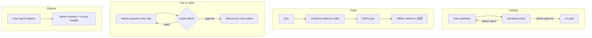
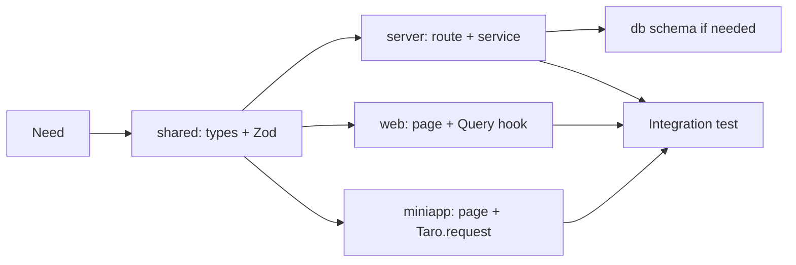

# AGENTS.md — rebook

This file is the working contract for AI coding agents (Cursor, Claude Code, etc.) operating in this repository. Read it before any non-trivial change. Conversational replies to the user use **Chinese**; code, identifiers, and inline comments use **English**.

---

## 1. Project overview

`rebook` is a **campus** C2C second-hand book marketplace. Product roles, payment, and governance rules are in **§2**; do not contradict them in code. It ships as **three apps in one repo** that share types and API contracts:

| App | Path | Role |
| --- | --- | --- |
| `@rebook/server` | `apps/server` | Elysia HTTP API, auth, persistence, business rules |
| `@rebook/web` | `apps/web` | React web client (browse, manage listings, admin) |
| `@rebook/miniapp` | `apps/miniapp` | Taro mini-program (WeChat: C2C + **admin**; **no** `super_admin` UI) |
| `@rebook/shared` | `packages/shared` | Cross-app types, Zod schemas, constants |

---

## 2. Product domain (authoritative; implement to match)

**Scope**: campus second-hand **books** only. The platform **charges sellers** (seller-side fee). **Payments are online**; **fulfillment is offline** (seller delivers or buyer self-pickup). There is **no** user-to-user messaging, forum, or public comments. **封禁 (ban)** = that user **cannot** perform any **normal** buyer/seller actions (enforced with `user` status + guards).

### 2.1 Roles and boundaries

| Role | `UserRole` (concept) | Responsibilities |
| --- | --- | --- |
| 普通用户 | `user` | Publish books, shop, multi-seller **cart → checkout (split orders)**, online pay, coordinate offline delivery / self-pickup. |
| 管理员 | `admin` | **Operational** ownership: **review listings**, **manage users (except super-admin and admin account creation)**, **resolve disputes** (sole tier; no super-admin in routine disputes), **propose** platform fee changes, **publish announcements**. |
| 超级管理员 | `super_admin` | **(1) Approve or reject _every_ admin-proposed fee-rate change** (each change is a separate approval; **all** go through super-admin). **(2) Create and configure _admin_ accounts** (only super-admin may grant/revoke admin). **Super-admin does not** routinely manage listings, users, or disputes—those stay with admin. |

**Client surfaces (authoritative): `admin` UIs exist on both `apps/web` and `apps/miniapp`. `super_admin` UIs exist only on `apps/web`** (no super-admin area in the mini-program).

### 2.2 Fee rate (平台向卖家收费)

- Admins create/update requests for **fee percentage (or rules)**. **Each** change is **pending super-admin approval** until approved.
- **No** fee change takes effect before approval. Until then, the **last approved** rate applies. **New orders** use the rate **effective at order time**; store a **rate snapshot** (or version id) on the order for audits.
- Super-admin: **approve** or **reject**; admin may resubmit after reject.

### 2.3 Listings

- User submits a listing → **admin review** → **on sale** or **rejected** (with reason, user may resubmit). Use explicit states in schema (`pending_review`, etc.).

### 2.4 Cart, checkout, orders

- **Multi-seller cart** → **split into multiple orders** (one per seller, or a clear parent/child order model—**pick one in DB and document it**). Each order line ties to one seller; fee computed **per order** (seller side).

### 2.5 Payment and fulfillment

- **Online payment, multi-channel**: **WeChat Pay** in the **WeChat mini-program**; on **web**, support **one or more** additional channels (e.g. other PSPs or browser flows—wire per provider in `env` + server). The server may host **multiple** payment integrators; each order records **which channel** was used; callbacks/webhooks are **idempotent** per channel.
- **Not** platform shipping: **seller** ships or **buyer** self-pickup; app records status (e.g. ready for pickup, completed handover).
- **Fulfillment coordination**: support both **free-text** fields (address, time windows, notes) **and** **map/location** affordances (e.g. coordinates, picked POI, campus pickup point)—sellers and buyers can use **either or both** as the product UIs allow.

### 2.6 Disputes (纠纷)

- **Admin** resolves disputes; **super-admin** is **not** in the default workflow.
- When a dispute is **closed/resolved**, persist **which admin account** handled it (`handled_by` or equivalent) for audit.
- **Open-dispute form** (web + miniapp): **text/reason and order ref are required**; **image attachments are optional** for users, but **the form must support image upload** (so evidence photos can be added when needed). Store evidence in object storage; same hygiene as book images (see `image-upload` skill).

### 2.7 Announcements (公告)

- Admins (and optionally super-admin, if the UI allows) **publish** announcements. **No “下线 / unpublish”** product requirement—treat as **permanent** published history; use **sort order** / **pin** / **“latest”** queries only, not a hidden state, unless the product spec changes.

### 2.8 Reference flow (Mermaid)



---

## 3. Tech stack & version constraints

- Runtime: **Bun ≥ 1.1** (server only), **Node.js ≥ 20** (web/miniapp tooling)
- Package manager: **pnpm ≥ 9** (enforced via `engines` and `packageManager`)
- Server: **Elysia.js** + **Drizzle ORM** + **PostgreSQL ≥ 15** + **Zod** + **drizzle-zod**
- Web: **React 18** + **Vite** + **TypeScript** + **Ant Design 5** + **Tailwind CSS** + **TanStack Query** + **Zustand**
- Miniapp: **Taro 4** + **React** + **TypeScript** + **NutUI-React-Taro**
- Auth: **JWT** (Web → httpOnly Cookie; miniapp → Bearer in `Authorization`)
- Object storage: abstract `StorageProvider` interface, default impl is **Tencent Cloud COS**
- Lint/format: **ESLint** + **Prettier**

Never bump major versions or swap the stack without explicit user approval.

---

## 4. Directory map (rules per area)

Each app has its own **`AGENTS.md`** with domain-specific checklists: `apps/server/AGENTS.md`, `apps/web/AGENTS.md`, `apps/miniapp/AGENTS.md`.

```
apps/
  server/
    src/
      app.ts              # Elysia root, plugin wiring
      modules/<domain>/   # route + service + repo + schema, one folder per domain
      db/
        schema/           # Drizzle table definitions
        client.ts         # Drizzle client singleton
        migrate.ts        # migration runner
      lib/                # cross-cutting utilities (auth, logger, errors, storage)
      env.ts              # validated env (Zod)
    drizzle/              # generated SQL migrations (committed)
    drizzle.config.ts
  web/
    src/
      pages/              # route-level components (one folder per route)
      components/         # reusable presentational components
      features/<domain>/  # domain-specific hooks, stores, api clients
      lib/                # api client, auth helpers, query client
      router.tsx
      main.tsx
  miniapp/
    src/
      pages/<page>/       # one folder per page, with .tsx + .config.ts
      components/
      services/           # Taro.request wrappers, login flow
      stores/             # Zustand or Taro built-in state
      app.ts / app.config.ts
packages/
  shared/
    src/
      api/                # API contract types (request/response DTOs)
      schemas/            # Zod schemas (single source of truth)
      constants/          # enums, error codes, regex
      index.ts            # public barrel
```

**Rules per area**

- `apps/web` and `apps/miniapp` MUST NOT import from `apps/server`. They may only import from `@rebook/shared` and their own folders.
- `apps/server` MUST NOT import any UI library or framework code.
- All HTTP DTOs MUST live in `packages/shared/src/api` and be the source of truth for both server validation and client typing.
- Any enum or magic string used by more than one app belongs in `packages/shared/src/constants`.

---

## 5. Coding conventions

- TypeScript everywhere. **No `any`** (use `unknown` + narrow). No `@ts-ignore` without a comment explaining why.
- Naming:
  - Files: `kebab-case.ts`; React components in `PascalCase.tsx`.
  - Variables/functions: `camelCase`. Types/interfaces/components: `PascalCase`. Constants: `SCREAMING_SNAKE_CASE`.
  - Domain folders are nouns (e.g. `book`, `order`, `user`), not verbs.
- Imports order: node builtins → external packages → `@rebook/*` → relative. Use absolute aliases (`@/`, `@rebook/shared`) over deep relative paths.
- Errors: throw a typed `AppError` (defined in `apps/server/src/lib/errors.ts`); never `throw new Error("...")` in business logic.
- Logging: use the shared logger; **no bare `console.log`** in committed code (a `console.warn` for genuinely exceptional client-side cases is OK).
- Async: prefer `async/await` over `.then`. Always handle rejections.
- React: function components only; no class components. Hooks at top of file. Co-locate component-only types with the component.
- Mini-program: avoid web-only globals (`window`, `document`); use `Taro.*` APIs for cross-end safety.
- Comments: explain **why**, not **what**. Skip narrating obvious code.

---

## 6. Cross-cutting rules (do not violate)

1. **Shared first**: any new HTTP endpoint starts with a DTO + Zod schema in `packages/shared`. Only then implement server and clients.
2. **Validate at the boundary**: server uses Zod via Elysia `t.Object` adapter or direct `schema.parse`. Never trust raw input.
3. **One source of truth for types**: clients import response types from `@rebook/shared`; do not redefine.
4. **No direct DB access from routes**: route → service → repository (Drizzle) → DB.
5. **Migrations are append-only**: never edit a migration that has been merged. Create a new one to fix.
6. **Secrets**: never commit `.env`. New env vars MUST be added to `apps/server/src/env.ts` with Zod validation and to `.env.example`.
7. **Two-app changes need a shared change**: if a new field appears in the web client UI, it almost always means `shared` and `server` need updates first.

---

## 7. Available skills (auto-loaded by trigger; full content in `.cursor/skills/<name>/SKILL.md`)

| Skill | Triggers when working on... |
| --- | --- |
| `elysia-route` | new/changed backend HTTP endpoints, controllers, route groups |
| `db-schema` | Drizzle tables, columns, indexes, migrations, seed data |
| `web-page` | React pages, routes, forms, components in `apps/web` |
| `taro-page` | Taro pages, tabbars, components, wx APIs in `apps/miniapp` |
| `shared-types` | DTOs, Zod schemas, enums, constants in `packages/shared` |
| `auth` | login, JWT, session, wx.login, route guards, role checks |
| `image-upload` | book photos, signed URLs, COS upload, thumbnails |

If a task touches a listed area, **read the corresponding SKILL.md before editing**.

---

## 8. Common workflows

### Add a new API endpoint (e.g. `POST /books`)

```
1. packages/shared/src/schemas/book.ts  → Zod schema for CreateBookInput
   packages/shared/src/api/book.ts      → request/response DTO types
2. apps/server/src/modules/book/        → route + service + repo + tests
3. apps/server/src/db/schema/books.ts   → table change (if needed)
   pnpm db:generate && pnpm db:migrate
4. apps/web/src/features/book/api.ts    → typed client + Query hook
   apps/web/src/pages/...               → page consuming the hook
5. apps/miniapp/src/services/book.ts    → Taro.request call
   apps/miniapp/src/pages/...           → page consuming the service
6. pnpm typecheck && pnpm lint && pnpm test
```



### Add a new database table

Follow the `db-schema` skill: define table → `pnpm db:generate` → review SQL → `pnpm db:migrate` → seed if needed.

### Add authentication-protected behavior

Follow the `auth` skill: pick the right guard middleware, never roll a new auth check.

---

## 9. Do / Don't

**Do**
- Run `pnpm typecheck && pnpm lint` before claiming a task is done.
- Use `pnpm` for every install (never `npm install` or `yarn add`).
- Place every domain change behind a Zod schema in `packages/shared`.
- Write a unit test next to any new server service function.
- Prefer composition over inheritance; small, single-purpose modules.

**Don't**
- Don't introduce a new dependency without confirming with the user (especially state libs, UI kits, ORMs).
- Don't import `apps/server` code from `apps/web` or `apps/miniapp`.
- Don't edit migrations that have been merged to `main`.
- Don't use `any`, `as unknown as X` chains, or `@ts-ignore` without justification.
- Don't bypass the shared types layer to "just get it working".
- Don't commit `.env`, `bun.lockb` conflicts, or build artifacts.

---

## 10. When unsure

- If a request is ambiguous (e.g. "add a search feature"): ask 1–2 narrowing questions before coding.
- If a change spans all three apps: switch to plan mode and outline the change before editing.
- If a third-party API is needed: confirm the choice with the user; do not silently introduce a new SDK.
